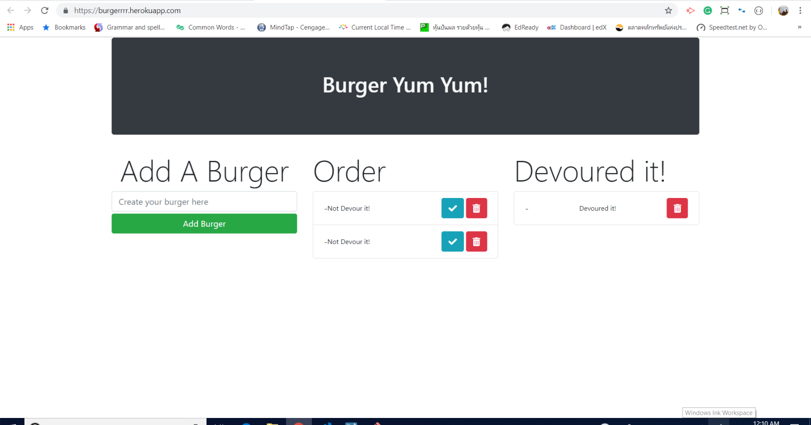

# Eat-Da-Burger!

* Eat-Da-Burger! is a restaurant app that lets users input a names of burgers that they would like to order.

* Whenever a user submits a burger's name, App will display the burger on the second column of the page -- waiting to be devoured.

* Each burger in the waiting area also has a `Devour it!` button. When the user clicks it, the burger will move to the right side of the page.

* App will store every burger in a database, whether devoured or not.

* User can delete their by a click at a delete botton.

# Screenshot

# Heroku page
https://burgerrrr.herokuapp.com/
